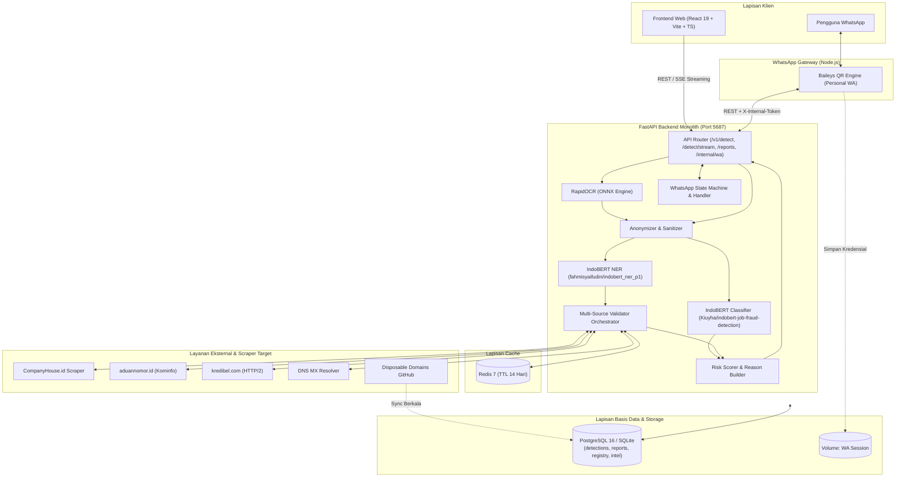

# Rancangan Arsitektur Sistem CePu

## Sistem Deteksi dan Edukasi Dini Risiko Penipuan Lowongan Kerja Berbasis Analisis Pola Iklan & Multi-Source Intelligence

Target metrik evaluasi model: akurasi ≥ 0,85; presisi kelas penipuan ≥ 0,88; recall kelas penipuan ≥ 0,82; F1 makro ≥ 0,85; serta latensi di bawah 1 detik untuk hasil tercache dan di bawah 3,5–5 detik untuk inferensi baru end-to-end (termasuk OCR dan validasi eksternal).

---

## 1. Ruang Lingkup

Sistem tidak menyediakan akun pengguna atau login publik, sehingga seluruh proses deteksi dan pelaporan bersifat anonim demi menjaga privasi pelapor. Antarmuka dibatasi pada dua kanal utama: aplikasi website modern berbasis React (Vite + TypeScript) dan bot interaktif WhatsApp (personal gateway via QR Baileys), tanpa aplikasi mobile native.

Crawling data tidak dijalankan secara live/on-the-fly pada setiap deteksi untuk portal lowongan umum, melainkan difokuskan pada:
1. Pembangunan dataset awal dan fine-tuning model klasifikasi NLP IndoBERT.
2. Validasi reputasi dan legalitas secara on-demand terhadap entitas yang diekstraksi (perusahaan, nomor telepon, dan email) dengan caching bertingkat (Redis TTL 14 hari dan database lokal).
3. Sinkronisasi berkala terhadap database intelijen (reputasi nomor, blacklist laporan terkonfirmasi, dan disposable email domains).

Sistem dioptimalkan secara mendalam untuk konten berbahasa Indonesia dengan dukungan toleransi entitas/teks campuran Bahasa Inggris.

---

## 2. Gambaran Umum Arsitektur

Sistem dirancang dengan arsitektur modular yang terdiri atas empat lapisan utama:
1. **Lapisan Klien (Frontend & Bot Gateway):**
   - **Website Frontend (React 19 + TypeScript + Vite + Modern UI):** Antarmuka web responsif dengan dukungan tema otomatis (dark/light mode), form deteksi multifitur (teks, ekstraksi gambar screenshot, dan input entitas terpisah), modal hasil analisis komprehensif, edukasi, dan formulir pelaporan scam. Mendukung pembaruan progres real-time via Server-Sent Events (`/v1/detect/stream`).
   - **WhatsApp Gateway (Node.js + Baileys):** Gateway mandiri yang menghubungkan nomor WhatsApp pribadi melalui scan QR code tanpa memerlukan akun bisnis resmi berbayar. Gateway bertindak murni sebagai transport layer yang meneruskan pesan masuk ke API Python.
2. **Lapisan Backend & AI Monolith (FastAPI + PyTorch/ONNX):**
   - Berjalan pada satu service kontainer terpadu (`cepu-backend`, port `5687`), menjalankan seluruh alur deteksi, orkestrasi validator, pemrosesan teks gambar, hingga logika bot interaktif WhatsApp.
   - Menggunakan model IndoBERT fine-tuned (`Kiuyha/indobert-job-fraud-detection`) untuk klasifikasi penipuan, model token-classification (`fahmisyaifudin/indobert_ner_p1`) untuk Named Entity Recognition (NER), dan engine **RapidOCR (ONNX Runtime)** untuk ekstraksi teks gambar tanpa beban berat pada CPU.
3. **Lapisan Cache & Antrean (Redis):**
   - Menggunakan Redis 7 untuk caching hasil verifikasi pihak ketiga (reputasi nomor, legalitas perusahaan, domain DNS) dengan TTL 14 hari guna meminimalkan request berulang, menghindari rate limit eksternal, dan memangkas latensi.
4. **Lapisan Basis Data Utama (PostgreSQL / SQLite):**
   - Mendukung PostgreSQL 16 (produksi via Docker Compose atau Supabase terkelola) dan SQLite lokal (`cepu_dev.db` / `cepu_test.db` untuk pengembangan). Akses data diisolasi menggunakan SQLAlchemy async repository layer.

---

## 3. Kebutuhan Data, Scraper, dan Sumber Intelijen

Sistem mengombinasikan data latih machine learning dan sumber intelijen live multi-sumber:

### A. Dataset untuk Training Model NLP

| Kategori | Sumber | Target / Jumlah | Field yang Diambil | Metode & Perlakuan |
| --- | --- | --- | --- | --- |
| **Lowongan Valid** | Portal karier resmi (JobStreet, Glints, Kalibrr, LinkedIn Jobs) dan portal karier korporasi terverifikasi | ~5.000 entri | Judul pekerjaan, deskripsi lengkap, nama perusahaan, kualifikasi, kontak | Scraping terkontrol; kurasi manual; pembersihan format dan anonimisasi data |
| **Lowongan Penipuan** | Media sosial (grup pencari kerja Facebook/Telegram), arsip hoaks (TurnBackHoax/Mafindo), dan laporan pengguna terverifikasi | ~2.000 entri | Teks narasi lowongan, nomor kontak penipu, modus (biaya tes/travel, iming-iming gaji tidak wajar, tugas berbayar) | Pengumpulan manual & semi-otomatis; pembersihan narasi boilerplate hoaks/fakta agar tidak membocorkan bias sumber |
| **Referensi Pola Global** | Dataset EMSCAD (Kaggle) | Digunakan secara selektif | Modus penipuan lowongan universal | Karena mayoritas berbahasa Inggris, EMSCAD **tidak** dicampur mentah ke korpus IndoBERT. EMSCAD difilter polanya, diterjemahkan secara selektif, dan digunakan sebagai penyusun kamus pola fitur linguistik & regex |
| **Data Uji Nyata (Hold-Out)** | Iklan lowongan kerja aktif selama masa evaluasi | 200 sampel riil | Teks, kontak, screenshot lowongan | Pelabelan manual konsensus tim untuk validasi performa di lingkungan dunia nyata |

### B. Validasi Multi-Sumber On-Demand (Multi-Source Intelligence)

Pengecekan entitas dilakukan secara modular dan asinkron dengan fallback ke cache Redis (TTL 14 hari):

| Sumber / Modul | Target Entitas | Data yang Diperiksa & Mekanisme | Penanganan Khusus & Fallback |
| --- | --- | --- | --- |
| **CompanyHouse.id Scraper** | Legalitas Nama Perusahaan | 8 atribut legalitas: nama badan usaha (`PT`, `CV`), nomor registrasi AHU/Kemenkumham, SK pengesahan, kota, alamat terdaftar, dan status keaktifan | Session scraping dengan auto-update cookie dinamis. Hasil disimpan ke database lokal `company_registry` |
| **aduannomor.id (Kominfo)** | Reputasi Nomor Kontak HP/WA | Formulir aduan resmi penipuan seluler Kominfo via HTTP POST terarah | Jika `reported_count > 0`, sistem memberikan penalti risiko tinggi (`0.95`). Jika bersih (`0`), dilanjutkan ke validator sekunder |
| **Kredibel.com Scraper (HTTP/2)** | Reputasi Nomor Kontak HP/WA | Halaman reputasi dan review pengguna via koneksi aman HTTP/2 | Digunakan sebagai fallback sekunder aduannomor.id. Auto-refresh cookie `kredibel_session` dan `XSRF-TOKEN` |
| **DNS MX & Domain Validator** | Keaslian Domain Email | Cek rekaman MX via `aiodns` / `dnspython`, rasio kemiripan (Levenshtein) dengan nama perusahaan, dan deteksi penyedia email publik gratis (`@gmail.com`, `@yahoo.com`) | Penalti klaim korporat PT/CV yang menggunakan email gratis (`0.70`). Deteksi modus typosquatting/impersonasi |
| **Disposable Email Blocklist** | Domain Email Sekali Pakai | Sinkronisasi daftar domain throwaway dari repositori open-source GitHub | Disimpan ke tabel `disposable_domains` melalui job berkala |
| **Blacklist Internal Intelijen** | Nomor HP, Email, & Perusahaan | Tabel internal `intel_blacklist` dari akumulasi laporan pengguna terverifikasi | Status aktif jika `report_count ≥ 2`; menjadi pengaman utama saat validator pihak ketiga mengalami kendala jaringan |

---

## 4. Pipeline Data dan Model Machine Learning

1. **Pembersihan & Preprocessing Teks:**
   - Menghapus emoji, markup HTML, dan narasi bocoran pemeriksa fakta (misal: `"turnbackhoax"`, `"cek fakta"`, `"beredar narasi"`).
   - Normalisasi teks, penanganan tag `#EMAIL_...#` / `#PHONE_...#`, dan penyusunan fitur statistik (jumlah digit, rasio kapital, panjang teks, kata kunci mencurigakan).
2. **Ekstraksi Entitas & Anonymization:**
   - **IndoBERT NER (`fahmisyaifudin/indobert_ner_p1`) + Heuristik Formal:** Mengekstrak nama entitas organisasi/perusahaan (`PT`, `CV`, dsb.).
   - **Regex Presisi Format Indonesia:** Mengekstrak nomor WhatsApp/telepon (`+62` / `08xx`), alamat email, dan URL.
   - **Anonimisasi:** Nomor telepon disamarkan (masking `08xx••••123`), NIK 16 digit dibersihkan, dan nama pribadi dinetralkan sebelum disimpan ke log atau dianalisis lebih lanjut.
3. **Model Klasifikasi IndoBERT (`Kiuyha/indobert-job-fraud-detection`):**
   - Fine-tuned transformer berbasis `indobenchmark/indobert-base-p2` dengan sequence length 512 token.
   - Inferensi dijalankan di CPU VPS menggunakan batch size teroptimasi dan pembatasan konkurensi (semaphore) agar konsumsi RAM tetap di bawah 2–4 GB dengan waktu inferensi 0,6–1,2 detik.
4. **Ekstraksi Gambar (RapidOCR ONNX):**
   - Gambar screenshot lowongan diproses menggunakan **RapidOCR** berbasis model ONNX Runtime ringan (tanpa ketergantungan binary Tesseract OS), menghasilkan teks yang bersih dan cepat untuk diproses langsung ke pipeline NLP.
5. **Formula Kalkulasi Risiko (Risk Scorer):**
   
   $$\text{Risk Score} = 0{,}40 \cdot P_{BERT} + 0{,}25 \cdot V_{company} + 0{,}25 \cdot V_{phone} + 0{,}10 \cdot V_{email}$$

   - **Kategori Risiko:**
     - **Rendah:** $[0{,}00 - 0{,}30]$ $\rightarrow$ Indikasi aman / wajar.
     - **Sedang:** $(0{,}30 - 0{,}60]$ $\rightarrow$ Memerlukan kewaspadaan / verifikasi tambahan.
     - **Tinggi:** $(0{,}60 - 1{,}00]$ $\rightarrow$ Indikasi kuat penipuan.
   - **Penyusunan `reasons[]` Otomatis:** Mengurai faktor pemicu skor tertinggi (kata kunci mencurigakan, ketiadaan rekaman legalitas, laporan nomor penipuan, email tidak resmi, dsb.).
   - **Rekomendasi Alternatif:** Menyajikan daftar lowongan kerja aman terverifikasi (`job_alternatives`) ketika risiko tergolong Sedang atau Tinggi.

---

## 5. Alur Deteksi End-to-End

```
[ Pengguna ] ── (Kirim Teks / Gambar / Kontak via Web atau WhatsApp)
     │
     ▼
[ API Validation & Rate Limiting ] ── (Maks 10 deteksi/menit per IP)
     │
     ├─► [Jika Gambar] ──► RapidOCR (ONNX) ──► Teks Hasil Ekstraksi
     │
     ▼
[ Anonimisasi Data & Preprocessing ]
     │ (Masking NIK, kontak, sanitasi narasi)
     ├─────────────────────────────────┬────────────────────────────────┐
     ▼                                 ▼                                ▼
[ IndoBERT Classifier ]      [ IndoBERT NER & Regex ]      [ Ekstraksi Fitur Linguistik ]
 (Hitung P_BERT)              (Deteksi Company, HP, Email)  (Deteksi indikator modus/biaya)
     │                                 │                                │
     │                                 ▼                                │
     │                    [ Validator Multi-Sumber ]                   │
     │                     ├─► CompanyHouse Scraper                     │
     │                     ├─► Aduannomor / Kredibel                    │
     │                     ├─► DNS MX & Typosquatting                   │
     │                     └─► Fallback Cache Redis                     │
     │                                 │                                │
     └─────────────────────────────────┼────────────────────────────────┘
                                       ▼
                             [ Risk Scorer Engine ]
                   (Hitung Risk Score, Kategori, & Reasons)
                                       │
                                       ▼
            [ Simpan ke Database, Update Cache, & Kirim Response/SSE ]
```

---

## 6. Diagram Komponen Sistem



---

## 7. Skema Basis Data

Aplikasi menggunakan skema relasional yang fleksibel (kompatibel PostgreSQL & SQLite):

1. **`detections`**:
   - `id` (UUID, PK), `created_at`, `channel` (`web` / `wa`), `text_input`, `ocr_text`, `features` (JSONB), `p_bert` (float), `v_company` (float), `v_phone` (float), `v_email` (float), `risk_score` (float), `category` (`rendah` / `sedang` / `tinggi`), `reasons` (JSONB), `degraded_sources` (JSONB), `processing_ms` (int), `model_version` (varchar).
2. **`reports`**:
   - `id` (UUID, PK), `created_at`, `channel`, `contact_optional`, `suspect_phone`, `suspect_email`, `suspect_company`, `message_raw`, `screenshot_path`, `status` (`pending` / `verified_scam` / `verified_legit` / `discarded`), `reviewer`, `note`.
3. **`company_registry`**:
   - `id`, `name_norm` (Index), `legal_name`, `ahu_no`, `registered` (bool), `is_flagged_scam` (bool), `details` (JSONB: nomor SK, kota, alamat, dsb.), `source`, `updated_at`.
4. **`intel_blacklist`**:
   - `id`, `kind` (`phone` / `email` / `company`), `value_hash`, `value_masked`, `report_count`, `last_reported_at`, `active` (bool, aktif jika `report_count ≥ 2`).
5. **`disposable_domains`**:
   - `domain` (PK), `source`, `added_at`.
6. **`education_articles`**:
   - `id`, `slug` (Unique), `title`, `body_md`, `tags` (JSONB), `published` (bool), `published_at`.
7. **`job_alternatives`**:
   - `id`, `company`, `title`, `url`, `verified_source`, `captured_at`, `active` (bool).
8. **`wa_sessions`**:
   - `phone_hash` (PK), `current_state`, `context` (JSONB), `last_active_at`.
9. **`model_artifacts`**:
   - `version` (PK), `storage_path`, `metrics` (JSONB), `deployed` (bool), `created_at`.

---

## 8. Kontrak API Utama

### A. Deteksi Sinkron: `POST /v1/detect`
Menerima `multipart/form-data`:
- `text`: Teks iklan lowongan kerja (opsional jika ada field lain).
- `company`: Nama perusahaan (opsional).
- `email`: Alamat email perekrut (opsional).
- `phone`: Nomor telepon/WA (opsional).
- `image`: File screenshot gambar lowongan (opsional, maks 2 MB).

**Contoh Response (200 OK):**
```json
{
  "request_id": "9439a619-66a2-4f51-b879-65dfaaac3346",
  "risk_score": 0.78,
  "category": "tinggi",
  "reasons": [
    "Teks lowongan menunjukkan pola bahasa yang sangat mirip modus penipuan",
    "Terdapat kata kunci mencurigakan: transfer dana, biaya pelatihan",
    "Nomor telepon terdaftar memiliki 3 aduan penipuan di Kominfo",
    "Perusahaan tidak ditemukan dalam basis data CompanyHouse/AHU"
  ],
  "alternatives": [
    {
      "company": "PT Solusi Teknologi Bersama",
      "title": "Junior Web Developer",
      "url": "https://karir.contoh.com/job/123"
    }
  ],
  "degraded_sources": [],
  "processing_ms": 1420,
  "model_version": "indobert-job-fraud-detection"
}
```

### B. Deteksi Streaming: `POST /v1/detect/stream` (SSE)
Menerima payload yang sama, mengirim event stream asinkron (`text/event-stream`):
- `event: progress` $\rightarrow$ `{"step": "ocr", "message": "Membaca teks dari gambar..."}`
- `event: progress` $\rightarrow$ `{"step": "nlp", "message": "Menganalisis pola teks dengan IndoBERT..."}`
- `event: progress` $\rightarrow$ `{"step": "validators", "message": "Memeriksa legalitas entitas..."}`
- `event: result` $\rightarrow$ `{ ...objek hasil deteksi lengkap... }`

### C. Pelaporan Scam: `POST /v1/reports`
Menerima form data: `suspect_phone`, `suspect_email`, `suspect_company`, `message_raw`, `screenshot`. Mengembalikan `{ "id": "uuid", "status": "pending" }`.

### D. Webhook WhatsApp Internal: `POST /internal/wa/inbound`
Hanya menerima request dari kontainer gateway dengan header `X-Internal-Token`.

### E. Healthcheck: `GET /healthz`
Status kesiapan service, database, redis, dan model AI.

---

## 9. Gateway WhatsApp (Personal Number via QR)

- **Engine Baileys:** Berjalan dalam kontainer Node.js (`cepu-gateway-wa`).
- **Autentikasi:** Menggunakan nomor WhatsApp pribadi via pemindaian kode QR terminal (`docker logs -f cepu-gateway-wa`). Kredensial tersimpan aman di volume Docker persistensi.
- **Logika Percakapan:** Seluruh state machine berada di backend Python. Alur percakapan:
  - Menu `1` atau `Edukasi`: Menampilkan artikel panduan mengenali loker bodong.
  - Menu `2` atau `Lapor`: Panduan pelaporan lowongan penipuan.
  - Menu `3` atau `Deteksi`: Panduan input format komprehensif.
  - Teks langsung / gambar tangkapan layar langsung: Otomatis memicu pipeline deteksi tanpa mengharuskan navigasi menu bertingkat.
- **Pencegahan Risiko Banned:** Murni menerapkan sistem balasan pasif (*reply-only*), tanpa broadcast massal, jeda balasan acak natural, dan disclaimer riset di setiap pesan.

---

## 10. Keamanan, Privasi, dan Retensi Data

1. **Anonimisasi Real-Time:** Penyamaran data sensitif (NIK dibuang, nomor telepon dimasking `08xx••••123`, sanitasi nama) sebelum masuk ke database log.
2. **Kebijakan Retensi Data:**
   - File tangkapan layar gambar upload dihapus secara otomatis setelah 7 hari.
   - Kolom teks mentah `text_input` dan `ocr_text` dibersihkan setelah 90 hari, hanya metrik agregat yang dipertahankan untuk evaluasi riset.
   - Sesi interaksi WhatsApp dibersihkan setelah 24 jam tanpa aktivitas.
3. **Penyimpanan Kredensial:** Variabel konfigurasi lingkungan terpusat pada file `.env` yang tidak dicatat pada version control.

---

## 11. Struktur Repositori & Deployment

```
CePu/
├── api/                  # Backend FastAPI
│   ├── core/             # Konfigurasi, exceptions, Redis cache
│   ├── db/               # SQLAlchemy models & repository layer
│   ├── routers/          # Endpoint /v1/detect, /detect/stream, /reports, /healthz, /internal/wa
│   └── services/         # IndoBERT inference, NER, RapidOCR, Scrapers, Risk Scorer
├── web/                  # Frontend Web (React 19 + TypeScript + Vite)
├── gateway-wa/           # WhatsApp Gateway (Node.js + Baileys QR)
├── scripts/              # Sinkronisasi disposable domains & utility DB
├── deploy/               # Caddyfile, template lingkungan .env.example
├── docker-compose.yml    # Konfigurasi orkestrasi 5 container
├── Dockerfile.backend    # Container build backend Python & PyTorch CPU
├── Dockerfile.web        # Container build frontend Nginx
└── Dockerfile.gateway-wa # Container build gateway WhatsApp
```

### Orkestrasi Docker Compose:
Stack berjalan dalam 5 container terhubung:
- `cepu-db`: PostgreSQL 16 Alpine.
- `cepu-redis`: Redis 7 Alpine.
- `cepu-backend`: FastAPI di port `5687`.
- `cepu-web`: Web server Nginx di port `3000`.
- `cepu-gateway-wa`: Node.js Baileys Gateway.
